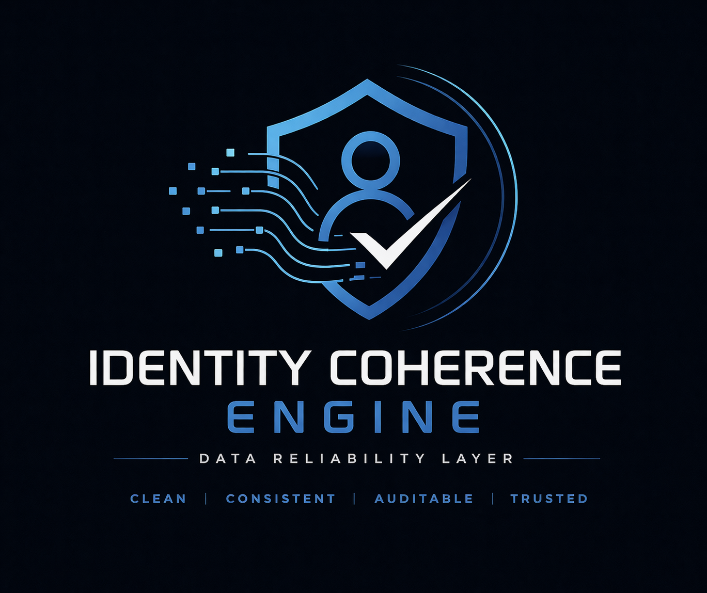

> Identity data coherence engine designed to improve data reliability before AI processing.
> ## 🤖 Demo: AI + Data Coherence

This project includes a simple demonstration showing how normalized data improves downstream AI processing.

Run:

```bash
python demo.py

## Intellectual Property Notice

While the source code in this repository is licensed under the MIT License, 
the underlying conceptual framework, system architecture, and decision logic 
(“Identity Coherence Engine”) are not fully covered by this license.

These elements constitute proprietary intellectual work and may not be reused, 
replicated, or commercialized without explicit permission from the author.

The MIT License applies strictly to the code implementation, not to the 
theoretical model, system design, or cognitive frameworks described herein.

# 🔵 Identity Coherence Engine

Moteur de normalisation et d’audit des données d’identité côté utilisateur.

## 🎯 Objectif

Ce projet démontre une implémentation minimale d’un moteur de cohérence des données permettant :

- la normalisation des attributs d’identité
- des transformations déterministes
- une traçabilité complète (audit log)
- une exécution locale sans dépendance externe

## ⚙️ Fonctionnement

Entrée :
- fichier JSON contenant des données d’identité

Sortie :
- données normalisées (`output.json`)
- journal d’audit (`audit.log`)

## 🔐 Propriétés

- comportement déterministe
- aucune connectivité réseau
- transformations transparentes
- système entièrement inspectable

## 🧪 Exemple

Entrée :
```json
{
  "first_name": "  jean ",
  "email": "JEAN.DUPONT@MAIL.COM "
}# identity-coherence-engine
User-side identity data normalization and audit engine
---

## 🔥 Advanced Demo

Run:

```bash
python advanced_demo.py


## Usage Restriction (Conceptual Layer)

This repository contains both technical implementation and higher-level 
methodological constructs.

Any attempt to reproduce or derive the underlying system logic, evaluation 
methods, or conceptual architecture for commercial or competitive purposes 
without authorization is explicitly discouraged.

For licensing inquiries regarding the full system or its conceptual components, 
please contact the author.
